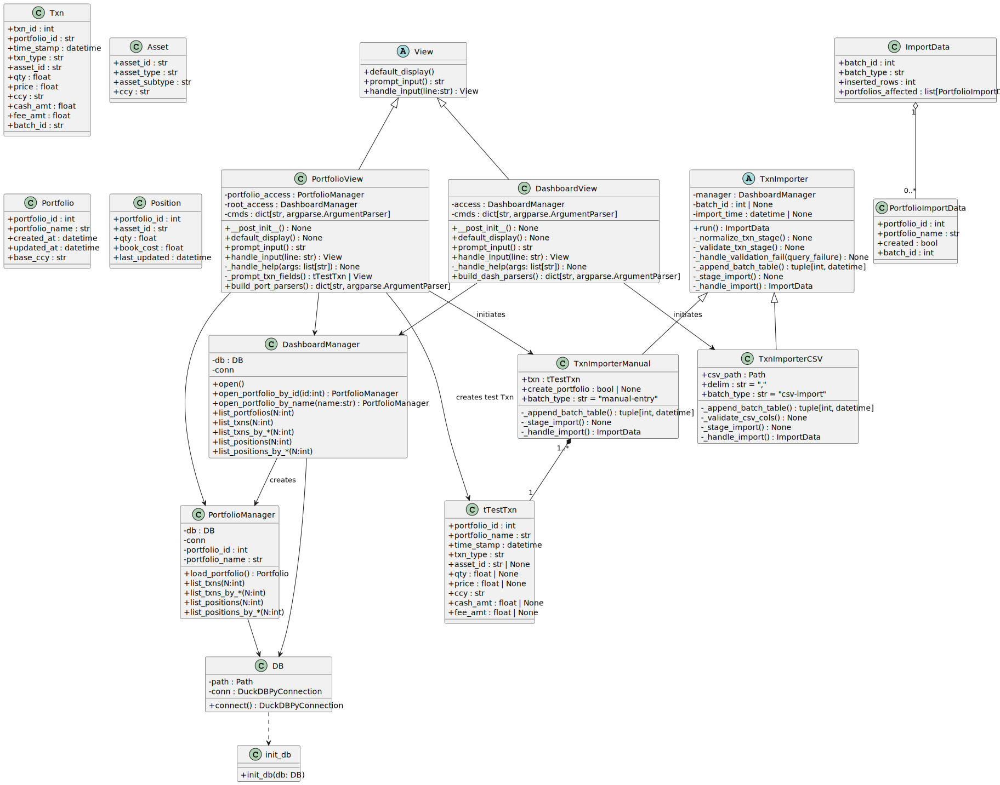
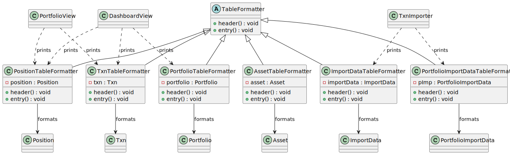

# Investment Dashboard Project
Author: Connor Proulx

Terminal-based portfolio management dashboard built in Python. The system allows users to create and manage portfolios, track transactions, view actively held positions.

Project emphasizes seperation of concerns, function dependant layered structure, documentation through UML class diagrams, ADR's, development through CI-backed testing and phase planning.

I am building this project to help consolidate, and manage my own personal finances, as well as familiarize myself with software engineering practices as I am actively learning in CMPUT 301: Software Engineering at the University of Alberta (W2026).
<br>


## Setup 
Open up Command Prompt on Windows, or Terminal on Mac/Linux and:
#### Grab your own local copy:
```
git clone https://github.com/greadee/quaint-dash.git 
cd quaint-dash
```
#### Standalone Environment
```
python -m venv .venv
.venv\Scripts\activate
```
#### Build dependencies:
```
python -m pip install --upgrade pip
python -m pip install -e ".[dev]"
```
#### (Dev) Linting and testing:
```
ruff check 
pytest
```
<br>


## Usage 

#### Run:
```
dashboard           # or python -m dashboard
```
#### Dashboard Commands: [Dashboard Commands](docs/usage/cmds/dashboard_cmds.md)
#### Portfolio Commands: [Portfolio Commands](docs/usage/cmds/portfolio_cmds.md)
<br>

## Records 
### Phase 0: Project and CLI setup
    - Github Actions
    - basic CLI setup and smoke test

#### Architectural Decision Records: [Main Decisions](docs/adr/adr_ph0.md)
--- 
<br>

### Phase 1: Data Modelling and CLI refinement

    - DB schema, queries
    - Domain models and storage layer
    - Normalized and validated transaction import for csv and manual entry
    - Refactor CLI into robust Unix-style terminal.
    - CLI cmds for displaying Portfolio, Position, Transaction data. 
    - CLI Formatters for displaying CLI cmds

#### Architectural Decision Records: [Main Decisions](docs/adr/adr_ph1.md)
--- 
<br>

## Diagrams


### Database E-R:
<br>


### App Core Components: 
<br>



### App Display:
<br>



## License: 


