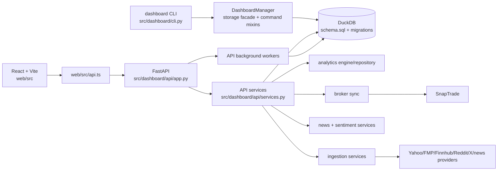
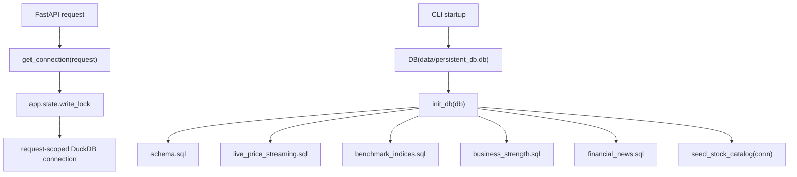
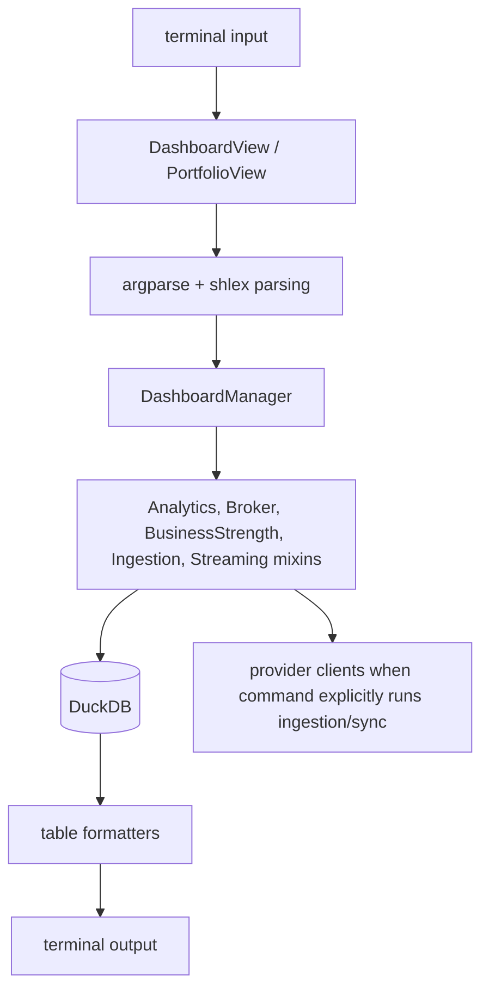
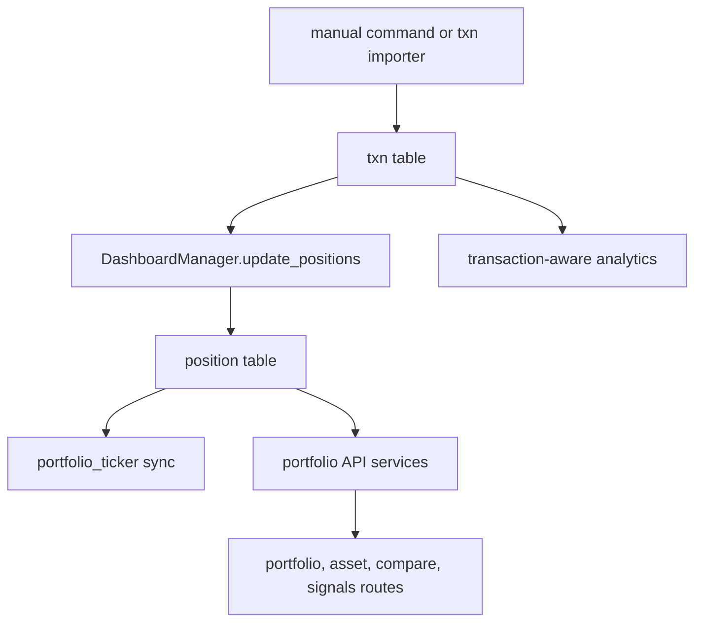
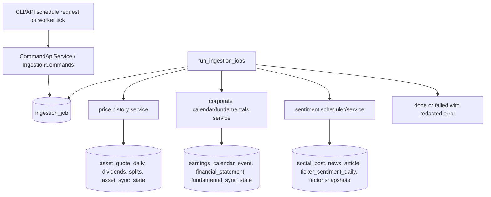
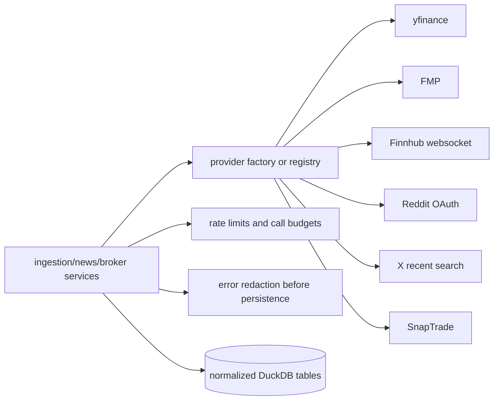
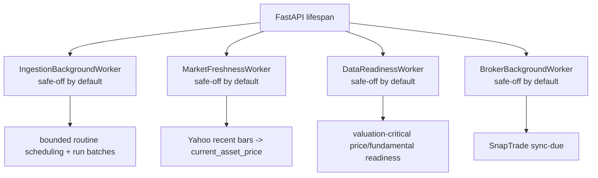
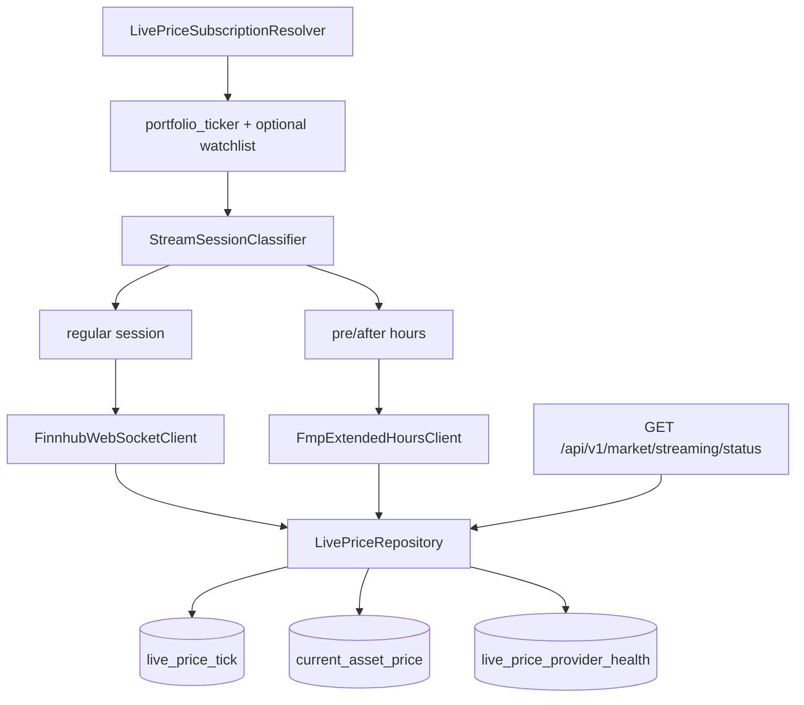
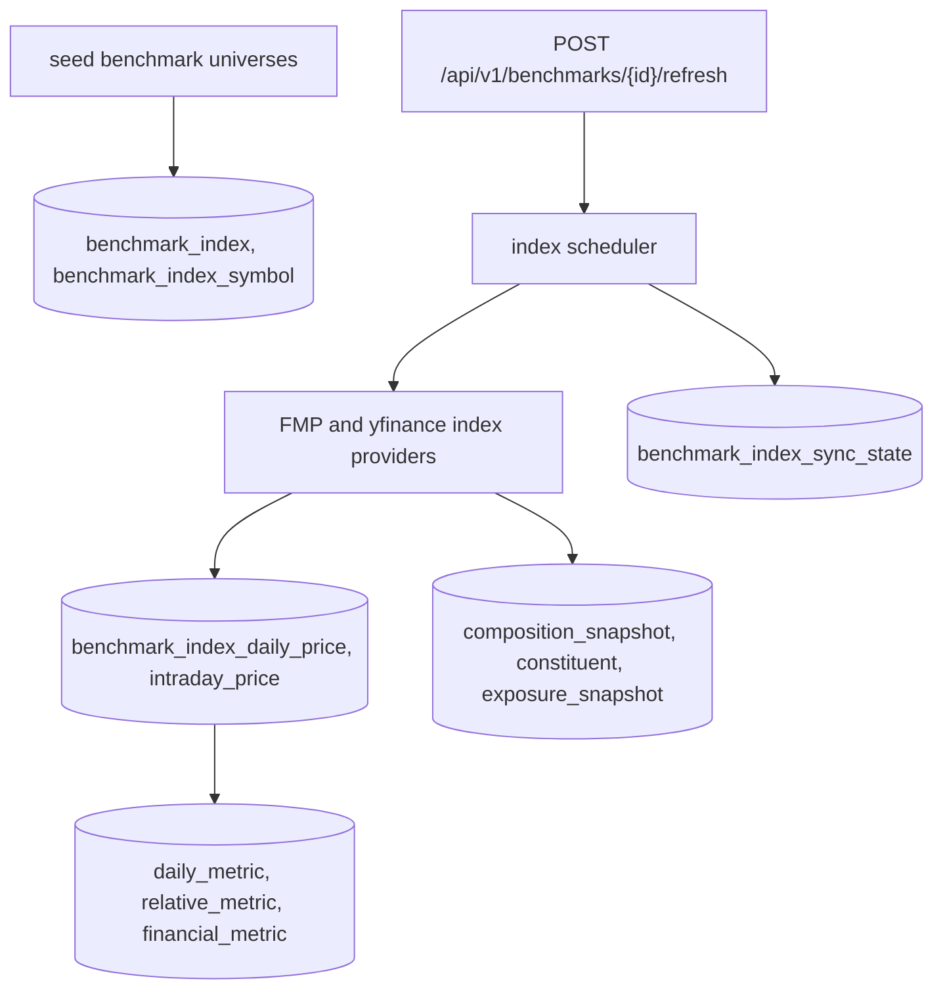
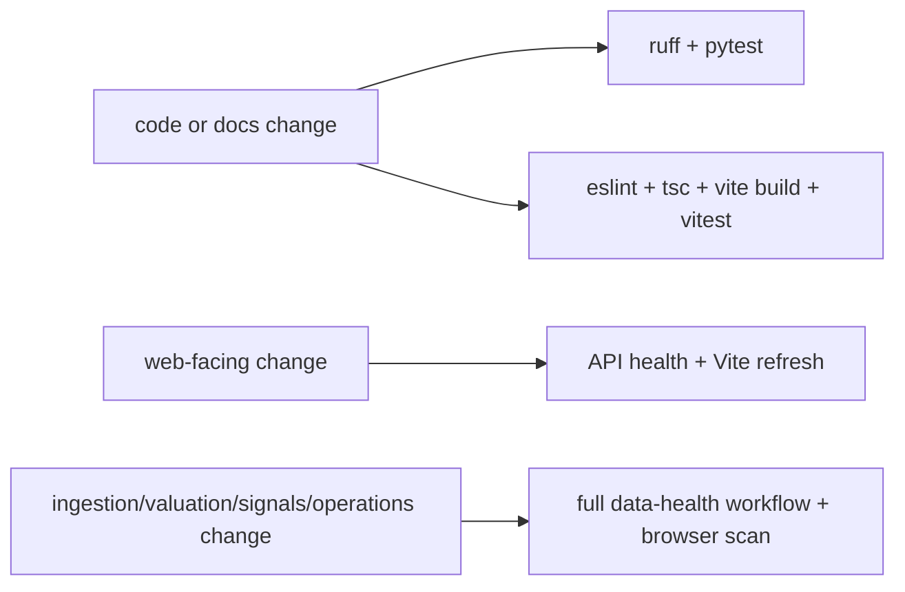

# Architecture Overview

This document reflects the current implementation in `src/dashboard`, `web/src`,
`src/dashboard/db/schema.sql`, and `src/dashboard/db/migrations/`.

For the Phase 1.5 target module boundaries, ownership matrix, dependency rules,
public interface catalog, migration sequence, and diagrams, see
[docs/architecture/README.md](architecture/README.md). This page remains the
current-state architecture overview.

## Local-first system

## Database access layer

The API opens and closes one DuckDB connection per request. Writes are serialized by the API
process lock. CLI commands use a long-lived `DB` connection through `DashboardManager`.

## CLI command flow

## Portfolio, transaction, and position flow

`position` is derived from transactions and refreshed by command/service code. `portfolio_ticker`
keeps ingestion scope aligned with active holdings.

## Ingestion job and scheduler flow

Failure behavior is recorded in `ingestion_job.error_message` and domain sync-state tables. Retry
logic skips newer successes and provider-permanent failures such as known entitlement limits.

## Provider integration flow

Provider credentials are read from environment variables. Tests use fake providers and monkeypatches
instead of real network calls.

## Background workers

The worker controls are exposed on the Operations route and `/api/v1/*/status` endpoints.

## Live quote and websocket flow

## Benchmark ingestion flow

## Test and CI flow

See `docs/testing.md` for exact commands.
