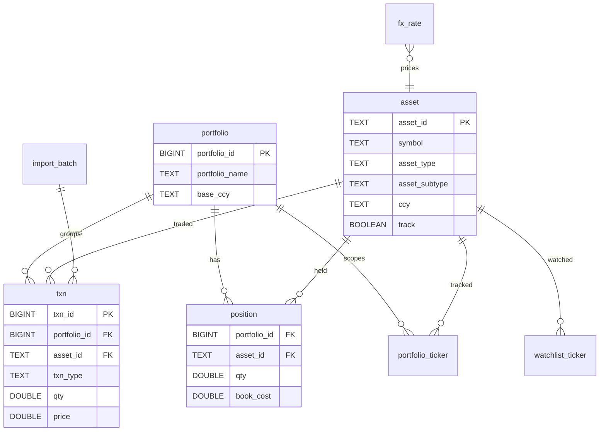
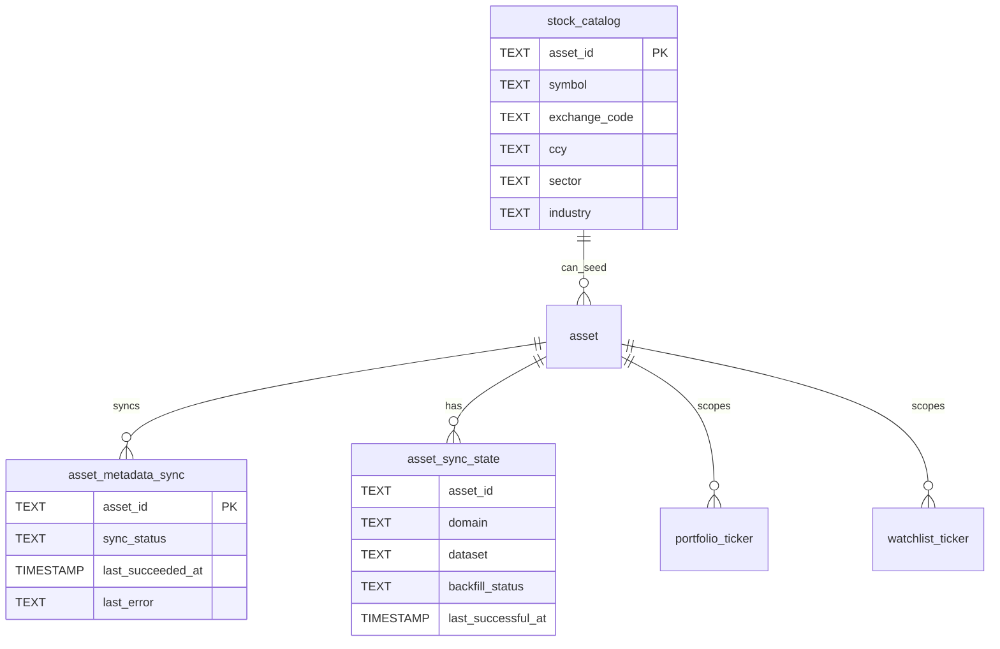
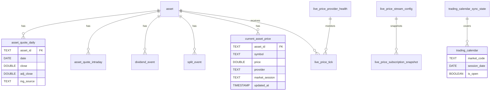
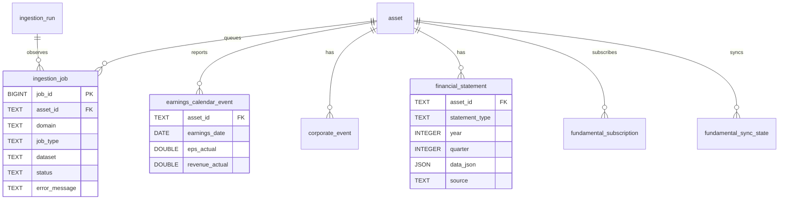
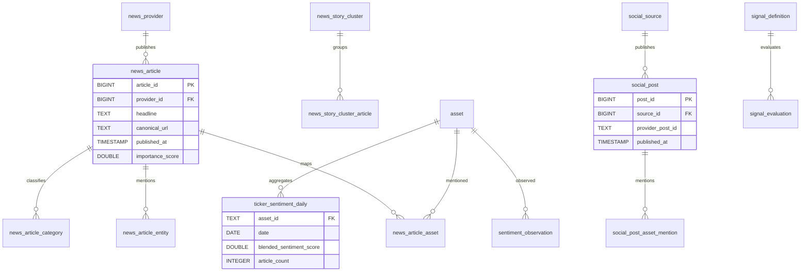
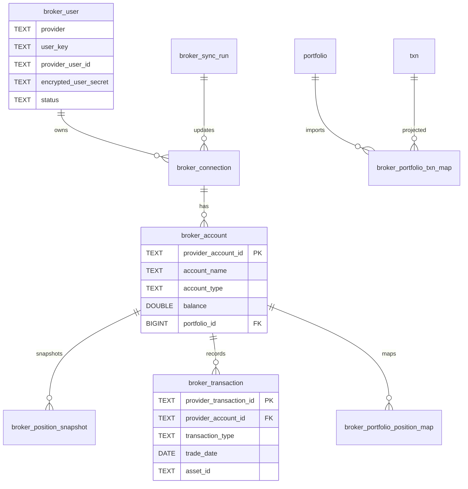
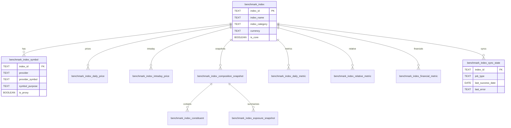
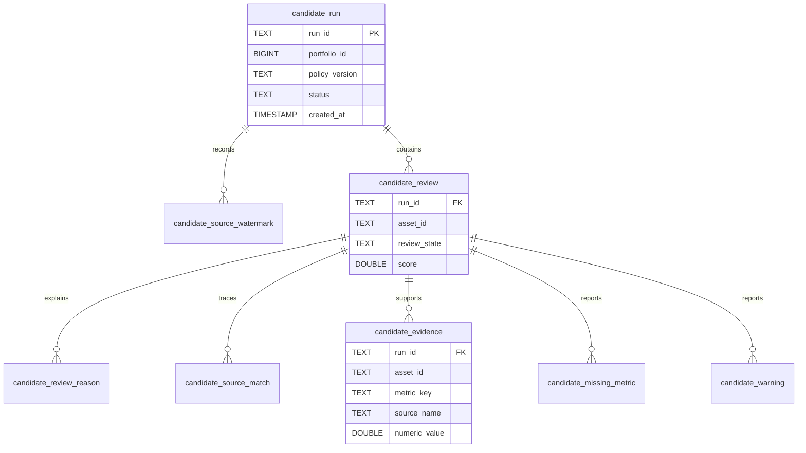

# Current Schema ER Diagrams

These diagrams are derived from `src/dashboard/db/schema.sql` and every committed migration under
`src/dashboard/db/migrations/`: live pricing, benchmark indices, Business Strength, financial
news, ticker universe, ingestion-job recovery, and candidate runs. They intentionally split the
schema into scoped domains so the diagrams remain readable.

## Core portfolio schema

Source of truth: transactions are the durable ledger; `position` is a derived/current position
table refreshed from transactions and broker projections.

## Asset metadata and ingestion scope

Source of truth: `asset` stores normalized tracked assets; `stock_catalog` expands search choices
without making every catalog symbol a tracked ingestion asset.

## Market data, live prices, and calendars

Source of truth: daily bars live in `asset_quote_daily`; live ticks are operational data in
`live_price_tick`, with latest state in `current_asset_price`.

## Ingestion jobs, corporate calendar, and fundamentals

Source of truth: `ingestion_job` records executable work and failures; `financial_statement`
stores provider statement JSON used by analytics and readiness.

## News, retail sentiment, factors, and signals

Source of truth: normalized news and social posts feed daily sentiment/factor snapshots. Raw
provider payloads are for debugging/reprocessing, not direct UI display.

## Broker schema

Source of truth: broker tables mirror read-only provider data. Local portfolio transactions become
authoritative only after explicit mapped import into `txn`.

## Benchmark schema

Source of truth: benchmark universe and provider symbols live in `benchmark_index` and
`benchmark_index_symbol`; prices, composition, exposure, metrics, and sync-state tables are derived
or ingested facts.

## Deterministic Candidate-Run Schema

Source of truth: these tables persist deterministic outside-holding research runs, source
watermarks, evidence, missing metrics, and warnings. They do not represent recommendations,
suitability decisions, orders, or LLM output. See the [candidate engine guide](../../features/candidate-engine.md).

## Known schema gaps

- `fx_rate` exists, but provider ingestion for dated FX rates is not implemented.
- Business-strength tables are present in `business_strength.sql` and are documented separately in
  `docs/features/business-strength.md`.
- Historical SVG ER diagrams under `docs/archive/diagrams/database/` may lag the current schema.
  Prefer this document for the live schema.
