# Full-Web-App Performance, Resource-Leak, and Endpoint Latency Audit

**Audit date:** 2026-07-23 (America/Edmonton)
**Repository:** `C:\Users\prool\quaint_dash`
**Data set:** the representative local production-like DuckDB database; no mock data was substituted
**Scope:** running FastAPI service, Vite development UI, locally served production UI, every top-level route, every major nested tab, the frontend API surface, repeated navigation, long-session resource behavior, ingestion/readiness health, and database query behavior

## A. Executive conclusion

The application is slow primarily because `get_connection()` opens and closes a new DuckDB connection while holding one process-wide `RLock` for the entire request. A trivial connect/`SELECT 1`/close costs **1.75–1.83 s** on this database. Eight concurrent health requests therefore completed serially at approximately **1.94, 3.87, 5.81, 7.77, 9.65, 11.57, 13.45, and 15.28 seconds**. This fixed per-request cost and serialization affect almost every database-backed endpoint before useful work begins.

The second cause is extreme endpoint-level N+1 work. With the connection cost removed in a diagnostic harness, `/overview/updates` still issued **916 queries**, `/portfolios` **914**, `/signals` **4,718**, one signal detail **5,247**, and ingestion readiness **1,781**. Several portfolio endpoints repeatedly inspect `information_schema`, load full per-asset histories, and recompute unchanged analytics. The signals detail endpoint recomputes the tracked universe instead of reading the already-stored signal evaluation.

The third cause is request lifecycle and page composition. The frontend does not pass TanStack Query cancellation signals into `fetch`, so requests abandoned on navigation continue holding the global backend queue. Leaving overview after 100 ms made a subsequent health request take **20.89 s**. Operations also starts seven 10-second polling queries, while several other pages poll every 60 seconds. Those requests are serialized behind the same lock. Route components are eagerly imported, so even Settings downloads the charting bundle.

Repeat navigation remains slow because the frontend cache lasts only 120 seconds, the backend has no reusable result cache or HTTP validators, expensive service caches are request-local, background refetches are not cancellable, and each actual refetch repeats connection setup plus N+1 computation. Warm responses were usually no faster than cold ones.

Conclusions:

- **A broad memory, thread, handle, or connection leak was not demonstrated.** Backend resources stabilized after repeated work: working set moved from 402.7 MB to 414.9 MB during navigation and later 431.9 MB after the full workflow; private bytes did not monotonically grow, and threads/handles remained approximately 26–28/274–308.
- **A request-work leak is demonstrated.** Abandoned HTTP work continues after route changes.
- **Database contention is demonstrated.** All database-backed HTTP requests and background database work share one application lock.
- **Ordinary GET page loads did not call external providers** in the provider-blocked trace. Explicit ingestion/readiness workflows did call providers and did contend with the app.
- **Payload size is a material secondary issue** on benchmark and broker pages, but it does not explain the universal 1.6–9.3 s API floor.
- **Frontend rendering is a major route-specific issue** for broker import: 6,289 DOM nodes, 391 rows, 16 tables, and repeated React-key errors. It is not the primary system-wide issue.
- **Cloud migration is not the current fix.** Moving the same lock, N+1 queries, and synchronous calculations across a network would retain the bottleneck and add latency.
- **Release readiness is currently blocked independently of performance:** after the mandated data-health workflow, the API reported at least 500 pending ingestion jobs (the endpoint cap), 2 jobs still marked running, and 138 failed. The workflow reproduced a DuckDB index-deletion error and multiple missing/null readiness inputs.

## B. System-wide findings

### Architecture map

```mermaid
flowchart LR
    A["Browser navigation"] --> B["React Router route"]
    B --> C["TanStack Query hooks / local state"]
    C --> D["fetch JSON request"]
    D --> E["FastAPI validation and middleware"]
    E --> F["get_connection: global RLock + new DuckDB connection"]
    F --> G["Route handler / API service"]
    G --> H["Repository queries and analytics engine"]
    H --> I["DuckDB tables"]
    H -. "explicit ingestion only" .-> J["External providers"]
    I --> K["Python transformation / Pydantic serialization"]
    J --> K
    K --> L["GZip HTTP response"]
    L --> M["JSON parse / query cache"]
    M --> N["React tables and Recharts render"]
```



Shared layers and invocation:

| Layer | Current implementation | Navigation behavior |
| --- | --- | --- |
| Frontend | React 19, React Router 7, Vite 6 | All route modules are imported eagerly at startup |
| Request/state | TanStack Query 5; `staleTime=120s`, retry off, focus refetch off | Cache survives navigation for bounded keys, but refetches after staleness and does not cancel abandoned `fetch` |
| Backend | FastAPI/Uvicorn, Pydantic models, GZip | One handler invocation per request |
| Database boundary | DuckDB file, about 410.0 MB | New connection and global lock per database-backed request |
| Services | API services, repositories, `AnalyticsEngine` | Recreated per request; summary cache is not shared across requests |
| Background work | Ingestion, market freshness, readiness, and broker workers in the API lifespan | Same process and database lock as interactive traffic |
| Providers | Market/corporate/news sources, including configured provider adapters | No provider attempt during traced GET audit; invoked by explicit background workflow |
| Charts | Recharts | Eager bundle and rebuilt when route content remounts |
| HTTP cache | GZip only | No `Cache-Control`, `ETag`, or conditional response support observed |
| WebSockets | Backend streaming/status infrastructure | No frontend WebSocket subscription found in the inspected web client |
| Browser persistence | No durable response cache used for route data | Query cache is memory-only |

### Reproducible environment

| Property | Measured value |
| --- | --- |
| OS | Windows 11, 64-bit |
| Logical processors | 12 |
| Python | 3.14.3 |
| Node / npm | 22.22.3 / 10.9.8 |
| Frontend modes | Vite development server at `127.0.0.1:5173`; production Vite build served by FastAPI at `127.0.0.1:8000` |
| Backend | FastAPI/Uvicorn local process |
| Database | DuckDB `data/persistent_db.db`, 410,005,504 bytes, 94 tables |
| Representative counts | 323 assets; 6 portfolios; 54 positions; 4,656 transactions; 7,413 broker transactions |
| Historical data | 176,920 asset-price rows; 171,474 benchmark-price rows; 171,440 benchmark-metric rows; 155,733 relative-metric rows |
| Other data | 738 financial-statement rows; 3 news rows; 1,704 signal-evaluation rows; 3,976 signal-evidence rows; 8,739 ticker-sentiment rows |
| Development tools | React Strict Mode and Vite development tooling enabled in dev; the production build was also measured |
| Browser extensions | In-app Browser session; extension impact not separately measurable |

Production mode did not remove the problem. Settings reached first useful content in about 3.64 s and settled in 4.30 s on first production load, while portfolio overview still took **45.91 s**. The same route ranged roughly **28.8–56.4 s** in development. The common backend path, not React development behavior, dominates.

## C. Route-by-route findings

The automated data-health browser scan opened **53 route instances**, including every top-level route and portfolio IDs 3–8 across the major portfolio tabs. Manual browser measurement added nested asset, signal, benchmark, and broker views plus direct production-mode checks.

Times below are end-to-end observed route settle times. Browser automation introduces a roughly 3-second control overhead on click-based measurements, so values are most useful for relative ranking and identifying tens-of-seconds failures. API timings in section D are the authoritative server values.

| Route / tab | Representative duration | Requests / endpoint families | DOM/render observation | Status and root cause |
| --- | ---: | --- | --- | --- |
| `/` dashboard | 9.47 s | overview, portfolios, summary data | Normal-sized view | Slow; 916-query overview plus serialized request waterfall |
| `/portfolios` workspace | 31.11 s cold; 9.43 s later | portfolios, aggregate overview/positions | Normal-sized view | Slow; 914 queries and per-portfolio analytics |
| `/portfolios/aggregate/overview` | 26.50 s | aggregate overview/positions | Normal-sized view | Slow; same 914-query summary path |
| `/portfolios/:id/overview` | 28.77–56.36 s | detail, positions, performance/risk/news/signals | Screenshot rendered correctly after wait | Critical waterfall; several serialized 2–5 s endpoints |
| `/portfolios/:id/holdings` | 10.19 s | positions, holding signals | 939 nodes; 8 charts; 8-row table | Slow; 137/711-query APIs |
| `/portfolios/:id/performance` | 9.96 s | performance history | 441 nodes and chart | Slow; 281-query recomputation |
| `/portfolios/:id/risk` | 8.38 s | risk metrics | Normal-sized view | Slow; 270-query recomputation |
| `/portfolios/:id/fundamentals` | 9.49–16.52 s | fundamentals | Normal-sized view | Slow; 405 queries, especially schema probes/full histories |
| `/portfolios/:id/optimization` | Feature-disabled; redirected to overview | overview family | Not an active tab in default feature state | Scanner still exercised requested paths; unavailable as a distinct enabled view |
| `/portfolios/:id/activity` | Feature-disabled; redirected to overview | overview family | Not an active tab in default feature state | Same limitation |
| Portfolio IDs 3–8, all major tabs | 53-route scan; many unresolved at observation timeout | Same families per ID | Repeated `Loading dashboard data` / `Unavailable` warnings | Blocking; confirms issue is not one portfolio fixture |
| `/asset/AAPL` chart/overview | 6.26 s | asset, prices, analytics | Chart rendered | Baseline connection dominates; analytics adds 36 queries |
| `/asset/AAPL/news` | 5.99 s | asset news | Small payload | Slow despite tiny response, proving payload is not universal cause |
| `/asset/AAPL/fundamentals` | 7.96 s | analytics/fundamentals | Normal-sized view | Backend calculation dominated |
| `/asset/AAPL/business-strength` | 8.18 s | business-strength | Normal-sized view | Multiple serialized endpoints |
| `/news` | 2.04 s | news, providers, categories | Small real data set | Fastest DB-backed page but still has ~1.6 s endpoint floor |
| `/retail-sentiment` | 10.47 s | sentiment/rankings/readiness | Table view | Slow endpoint composition; rankings measured at 4.36–9.67 s |
| `/signals` | Endpoint 4.89–5.02 s; UI skeleton timing initially undercounted | signals | Large calculated collection | 4,718 queries; recalculates full universe |
| `/signals/:key` | 8.81 s | signals detail | Detail view | 5,247 queries; recomputes full universe for one row |
| `/compare` | 12.38 s | comparison workspace | Comparison charts/tables | 57.1 KB response; server itself ~1.67 s, route waterfall/render adds time |
| `/benchmarks` | 17.17 s | benchmark list and associated data | 1,783 nodes; 34 rows | Large route and payload composition |
| `/benchmarks/SP500` | 14.54 s | detail, prices, metrics, constituents, exposures | Multiple charts/tables | 314.8 KB prices + 196.8 KB metrics; serialized requests |
| `/brokers` | 29.41 s | status, connections, accounts, reconciliation | Multiple sections | Serialized calls and heavy descendants |
| `/brokers/accounts` | 19.85 s | accounts/reconciliation | Table view | Several serialized baseline-cost calls |
| `/brokers/import` | 14.43–15.38 s | import preview/reconciliation | **6,289 nodes, 391 rows, 16 tables** | Backend plus severe unvirtualized rendering; duplicate React keys |
| `/brokers/history` | 14.64 s | sync history | Table view | Serialized endpoint waits |
| `/brokers/settings` | 8.67 s | broker status/settings | Small view | Shared connection floor, not content complexity |
| `/operations` | 10.10 s | jobs + 3 worker states + readiness/status data | 1,702 nodes | Seven 10-second pollers can sustain request pressure |
| `/settings` | 0.22 s warm dev; 4.30 s first production | mostly local | Small view | Demonstrates routes without database work can be responsive; initial bundle remains large |

Warm switching:

- Ten Settings ↔ Brokers switches showed no progressive slowdown and no DOM growth. Cached navigation settled at the automation floor after click overhead while entries remained fresh.
- The benefit disappears when data becomes stale or when a route triggers uncached keys; the backend recomputes the same results.
- A 50-change representative session across route, portfolio, asset, timeframe, and tab changes did not show monotonic backend resource growth, but it did repeatedly create queued HTTP work.
- Optimization/activity tabs are feature-disabled in the default configuration, so they could not be measured as distinct rendered implementations.

## D. Endpoint-by-endpoint findings

### Live HTTP latency and response size

The table records two sequential live calls using the representative database. Payload is uncompressed JSON. All successful database-backed responses lacked `Cache-Control` and `ETag`. The two invalid calls in the original sweep were corrected and remeasured immediately afterward.

| Endpoint | Cold ms | Repeat ms | JSON bytes | Result / main issue |
| --- | ---: | ---: | ---: | --- |
| `GET /health` | 3,460 | 2,337 | 68 | Connection + global lock dominate a trivial query |
| `GET /overview/updates` | 7,932 | 9,294 | 10,934 | 916 queries; request-local portfolio recomputation |
| `GET /portfolios` | 7,687 | 6,822 | 4,131 | 914 queries for six rows |
| `GET /portfolios/aggregate/overview` | 7,141 | 6,676 | 700 | Same 914-query path |
| `GET /portfolios/aggregate/positions` | 1,746 | 1,731 | 31,711 | Only 2 queries; connection floor |
| `GET /portfolios/3` | 2,359 | 2,384 | 676 | 135 queries |
| `GET /portfolios/3/positions` | 4,101 | 2,547 | 7,019 | 137 queries |
| `GET /portfolios/3/performance` | 3,580 | 3,632 | 11,841 | 281 queries; history recomputation |
| `GET /portfolios/3/risk` | 3,288 | 3,239 | 8,118 | 270 queries |
| `GET /portfolios/3/fundamentals` | 4,087 | 4,057 | 14,714 | 405 queries; repeated schema/history reads |
| `GET /portfolios/3/transactions` | 2,372 | 2,360 | 7,663 | 137 queries for a paged result |
| `GET /portfolios/3/news` | 1,586 | 1,606 | 1,519 | Connection floor |
| `GET /holdings/signals` | 2,958 | 3,046 | 17,962 | 711 queries |
| `GET /assets?limit=25` | 1,631 | 1,610 | 5,255 | Connection floor |
| `GET /assets/AAPL` | 1,595 | 1,574 | 381 | Connection floor |
| `GET /assets/AAPL/prices` | 1,605 | 1,588 | 12,229 | Connection floor; query itself is fast |
| `GET /assets/AAPL/analytics` | 2,691 | 2,688 | 9,356 | 36 queries; DB calculation 1.44 s after reuse |
| `GET /assets/AAPL/business-strength` | 1,690 | 1,767 | 14,793 | 13 queries |
| `GET /assets/AAPL/news` | 1,572 | 3,151 | 245 | Queue variance dominates tiny payload |
| `GET /assets/AAPL/holdings` | 1,601 | 1,623 | 2 | 2-byte response still takes ~1.6 s |
| `GET /assets/AAPL/activity` | 1,663 | 1,636 | 3,839 | Connection floor |
| `GET /news` | 1,585 | 1,575 | 4,033 | Connection floor |
| `GET /news/providers` | 1,566 | 1,584 | 408 | Connection floor |
| `GET /news/categories` | 1,564 | 1,581 | 4,363 | Connection floor |
| `GET /retail-sentiment` | 1,634 | 1,598 | 27,360 | Connection floor |
| `GET /rankings/stocks` corrected | 4,356 | 9,674 | 29,121 | Full ranking calculation; queue variance |
| `GET /signals` | 4,891 | 5,017 | 66,234 | 4,718 queries |
| `GET /signals/:key` | 5,361 | 5,385 | 3,739 | 5,247 queries to return one signal |
| `GET /comparison/workspace` | 1,666 | 1,690 | 57,133 | 63 queries; payload/render secondary |
| `GET /benchmarks/associations/asset/AAPL` | 1,867 | 1,893 | 579 | 8 queries; one catalog lookup is expensive |
| `GET /benchmarks` | 1,597 | 1,623 | 23,717 | Connection floor |
| `GET /benchmarks/SP500` | 1,644 | 1,606 | 2,266 | Connection floor |
| `GET /benchmarks/SP500/prices` | 1,617 | 1,606 | 314,826 | Large response; compressed to 43,136 bytes |
| `GET /benchmarks/SP500/metrics` | 3,175 | 1,593 | 196,835 | Large response; first-call variance |
| `GET /benchmarks/SP500/constituents` | 1,643 | 1,575 | 2,855 | Connection floor |
| `GET /benchmarks/SP500/exposures` | 1,580 | 1,575 | 818 | Connection floor |
| `GET /brokers/status` | 1,555 | 1,564 | 498 | Connection floor |
| `GET /brokers/connections` | 1,588 | 1,594 | 634 | Connection floor |
| `GET /brokers/accounts` | 1,594 | 1,644 | 4,780 | 11 queries |
| `GET /brokers/import-preview` | 1,845 | 1,835 | 168,017 | 1 DB query; ~256 ms transform/serialization; 16,272 bytes gzip |
| `GET /brokers/reconciliation` | 1,581 | 1,581 | 66,480 | Payload/render issue |
| `GET /brokers/sync-history` | 1,614 | 2,101 | 8,857 | Connection/queue variance |
| `GET /ingestion/jobs` | 1,918 | 2,135 | 32,219 | Connection plus 100-row serialization |
| `GET /ingestion/background/status` | 1.3 | 1.5 | 345 | In-memory; proves FastAPI itself is fast |
| `GET /market/freshness/status` | 1.3 | 1.0 | 228 | In-memory |
| `GET /data/readiness/status` | 1.0 | 0.9 | 386 | In-memory |
| `GET /ingestion/retail-sentiment/status` | 1,744 | 1,763 | 2,884 | Connection floor |
| `GET /ingestion/readiness` | 3,017 | 2,878 | 101,698 | 1,781 queries; 3,321 bytes gzip |
| `GET /ingestion/ranking-readiness` corrected | 2,225 | 2,438 | 24,850 | Per-asset readiness work |
| `GET /market/streaming/status` | 2,396 | 2,436 | 7,633 | 17 queries, 833 ms DB after reuse |

### Timing breakdown with one reused database connection

The diagnostic harness opened one read-only base connection once, acquired a fresh cursor per request, blocked provider libraries, and traced SQL. This isolates connection acquisition from handler work. The one-time connection open was **1,781 ms**; subsequent cursor acquisition was generally below **0.1 ms**.

| Endpoint | Total ms | Queries | DB execute ms | Transform/validation/serialization ms | Observed loaded rows | External provider |
| --- | ---: | ---: | ---: | ---: | ---: | ---: |
| overview | 5,657 | 916 | 5,219 | 438 | 240,816 | 0 |
| portfolios | 6,342 | 914 | 5,849 | 493 | comparable to overview | 0 |
| aggregate overview | 6,105 | 914 | 5,635 | 469 | comparable to overview | 0 |
| portfolio detail | 1,070 | 135 | 956 | 114 | — | 0 |
| positions | 1,092 | 137 | 1,004 | 88 | — | 0 |
| performance | 2,445 | 281 | 2,222 | 223 | — | 0 |
| risk | 2,310 | 270 | 2,102 | 208 | — | 0 |
| fundamentals | 3,021 | 405 | 2,723 | 298 | — | 0 |
| transactions | 907 | 137 | 818 | 89 | — | 0 |
| holding signals | 1,519 | 711 | 1,398 | 121 | — | 0 |
| asset analytics | 1,450 | 36 | 1,440 | 10 | — | 0 |
| signals | 3,692 | 4,718 | 3,372 | 320 | 222,084 recent-price rows plus factor inputs | 0 |
| signal detail | 4,158 | 5,247 | 3,788 | 370 | full universe, though one item is returned | 0 |
| comparison | 64 | 63 | 55 | 9 | — | 0 |
| ingestion readiness | 1,090 | 1,781 | 1,062 | 28 | per-asset/per-dataset status rows | 0 |
| streaming status | 839 | 17 | 833 | 6 | — | 0 |
| broker import preview | 266 | 1 | 10 | 256 | large nested response | 0 |
| aggregate positions | 124 | 2 | predominantly query/transform | — | — | 0 |
| health | 7.6 | 1 | 0.4 | 7.2 | 1 | 0 |

The harness is intentionally diagnostic rather than production middleware. It changed only the connection boundary and prevented network calls; it did not replace data or calculations. Its result proves that a reusable connection removes the universal floor, while N+1 endpoints still require redesign.

## E. Leak findings

| Resource | Evidence | Conclusion |
| --- | --- | --- |
| Abandoned requests | Navigate away from overview after 100 ms; next `/health` took 20.89 s versus a 2.79 s baseline | **Confirmed request-work leak.** Query functions ignore the supplied cancellation signal |
| Duplicate/request storm | Operations starts seven 10-second refetch intervals; overview/portfolio/news queries commonly poll at 60 seconds | **Confirmed pressure source.** With serialization, pollers can overlap and sustain a queue |
| Query cache | Stable keys, 120-second staleness, default bounded garbage collection | No unbounded cache leak found; cache policy is too short/shallow for unchanged analytical data |
| Backend memory | Working set 402.7 MB initially, 414.9 MB after navigation, 431.9 MB after full health workflow; private bytes were not monotonic | No monotonic backend memory leak demonstrated |
| Threads | Approximately 28 initially, 27 after navigation, 27 after workflow | Stable |
| Handles | 278 initially, 276 after navigation, 308 after full workflow | Some workflow growth, but no monotonic request-by-request leak demonstrated |
| DuckDB connections | One per DB request, closed in dependency `finally`; serialized by lock | No unreleased connection found, but lifecycle is catastrophically expensive |
| Timers/listeners | Notification timeout cleanup present; Query polling is component/query managed | No orphan timer/listener proven |
| Charts | Recharts components unmounted on route change; DOM did not grow in 10 switches | No chart-instance leak demonstrated |
| HTTP sessions | No ordinary GET provider calls in the blocked-provider trace | No page-load HTTP-client leak demonstrated |
| WebSockets | No active frontend subscription implementation found | No WebSocket leak demonstrated; status endpoint itself is DB-heavy |
| Background tasks | Four workers start in the API lifespan and share the process/database boundary | No duplicate scheduler proven; contention and stuck job state are confirmed operational risks |
| Browser heap | Supported in-app browser interface did not expose a heap snapshot | Retained-object growth remains an explicit unknown, not evidence of a leak |

## F. Database findings

### Contention and connection lifecycle

`src/dashboard/api/dependencies.py` holds `request.app.state.write_lock` for the whole dependency lifetime, including all queries, calculation, response-model work before teardown, and connection close. This serializes independent reads with writes and with one another.

- New connection + `SELECT 1` + close: **1.747–1.834 s** across ten repetitions.
- Reusing one base connection and opening a cursor: **0.08–0.50 ms** for cursor + `SELECT 1` + close.
- Eight concurrent health calls: tail latency **15.28 s**.
- A 20-request burst took **59.1 s** under later system/workflow contention.
- In-memory worker-status endpoints return in approximately **1 ms**, proving the web server and loop are not the source of the fixed delay.

### Repeated query patterns

Portfolio list/overview/aggregate:

- 44 `information_schema.tables` existence checks, roughly **4.1–4.7 s** combined.
- 162 per-asset full price-history queries, roughly **636–675 ms**, loading about **193,637 rows**.
- 162 financial-statement queries.
- 108 asset lookups, 80 latest-close queries, 54 cash-flow queries, plus repeated dividends and calculations.
- `PortfolioApiService._portfolio_summary()` invokes `_portfolio_projection()`, which calls `AnalyticsEngine.portfolio_report()` for every portfolio on a simple list.

Portfolio fundamentals/performance/risk:

- Fundamentals: 21 catalog checks consumed about **2.11 s**; 72 full-history reads loaded about **112,005 rows**.
- Performance/risk: 14–17 catalog checks consumed about **1.65–1.75 s**; 48 full-history reads loaded about **74,670 rows**.

Signals:

- `/signals` loops 291 tracked assets across factors.
- 873 “recent 260” price queries loaded **222,084 rows** and used about **836 ms** alone.
- Hundreds of income, sentiment, earnings, and institutional queries follow.
- `/signals/:key` calls the full-universe calculation and then selects one result despite 1,704 stored `signal_evaluation` rows.

Readiness:

- 444 job-count queries, 444 error queries, 370 state queries, 74 price-count queries, and related checks produce **1,781 queries**.

### Query plans and indexing

Captured DuckDB plans are in `tmp/duckdb-query-plans.json`.

- AAPL full price history: index scan, 253 returned rows, about **2.8 ms**.
- AAPL recent 260: sequential scan/top-N, about **1.2 ms**.
- Latest ticker sentiment: about **1.8 ms**.
- One `information_schema.tables` existence check: about **90.1 ms**, scanning catalog tables/views.

Individual fact-table queries are mostly millisecond-scale. The dominant database problem is query multiplicity and catalog probing, not a single missing index. Adding generic indexes before eliminating these loops would not fix the observed route latency.

### Storage maintenance and readiness

The database has 23 indexes and 3,722 ingestion-job rows before the mandated workflow. The full workflow later produced:

- at least 500 pending jobs (API cap),
- 2 still marked running,
- 138 failed,
- a timeout in the readiness tick,
- a portfolio performance timeout,
- a DuckDB “failed to delete all rows from index” mutation error,
- nine subscribed tickers without current-price rows after refresh,
- null/missing critical analytics inputs and infeasible optimization previews.

Before performance changes are declared safe, repair the ingestion-job index/write failure, reconcile stale running jobs, and drain or intentionally classify pending/failed work. Do not vacuum or rebuild indexes blindly while the API process owns the database.

### Recommended data lifecycle

Use:

`source data or transaction changes → background derived-metric calculation → versioned summary/snapshot tables → interactive endpoint reads latest complete snapshot`

Precompute portfolio performance/risk/fundamentals and signal/ranking snapshots after relevant source changes. Interactive GETs should not rebuild full historical calculations when inputs are unchanged.

## G. Frontend findings

1. `request()` in `web/src/api.ts` does not accept/pass TanStack Query’s `AbortSignal`. Navigating away therefore abandons the consumer but not the backend work.
2. Operations has seven 10-second polling queries. Other route families commonly poll at 60 seconds. Polling is disproportionate for a globally serialized, mostly local analytical backend.
3. Query cache configuration is reasonable for fast transactional APIs but not for deterministic historical analytics. Two minutes is too short when source version has not changed.
4. Route components are eager imports. Production build output included approximately:
   - main: 474.9 KB / 127.0 KB gzip,
   - charts: 433.0 KB / 115.4 KB gzip,
   - routing: 96.4 KB / 31.3 KB gzip,
   - icons: 20.4 KB / 4.5 KB gzip,
   - CSS: 118.0 KB / 21.9 KB gzip,
   - fonts: about 343 KB combined.
5. Broker import renders 6,289 DOM nodes and 391 rows in 16 tables. It needs pagination/windowing and collapsed groups.
6. Broker pages emit repeated duplicate React-key console errors. Besides correctness risk (duplicated/omitted DOM), the keys/logs include stringified raw instrument objects, which is unnecessary console and privacy exposure.
7. No evidence showed expensive Settings rendering or universal React-side delay. Routes without DB calls are fast when warm.
8. Browser network HAR, per-component render counts, JSON parse timings, and browser heap snapshots were not available through the supported in-app inspection surface. Backend and DOM evidence were used instead.

Recommended request composition:

- Fetch a portfolio identity/summary first.
- Fetch visible holdings or default-period chart second.
- Defer risk, fundamentals, long history, news, signals, and optimization until their tab/widget is visible.
- Avoid dozens of tiny calls; use one summary endpoint plus one visible-detail endpoint.
- Cancel hidden-route requests and reduce polling to status-version checks or explicit invalidation.

## H. Payload findings

Largest uncompressed responses:

| Endpoint | Uncompressed | Measured gzip | Assessment |
| --- | ---: | ---: | --- |
| benchmark prices | 314,826 B | 43,136 B | Too much history for initial list/detail shell; downsample/default range first |
| benchmark metrics | 196,835 B | not separately captured | Load visible metric window first |
| broker import preview | 168,017 B | 16,272 B | Network compression is good; 391-row DOM expansion is the larger cost |
| ingestion readiness | 101,698 B | 3,321 B | Highly compressible but generated by 1,781 queries; summarize then paginate details |
| broker reconciliation | 66,480 B | not separately captured | Paginate/group on demand |
| signals | 66,234 B | 5,593 B | Response is moderate after gzip; calculation cost dominates |
| comparison workspace | 57,133 B | 15,252 B | Defer non-visible fundamental/detail sections |
| aggregate positions | 31,711 B | not separately captured | Acceptable if immediately visible |
| ingestion jobs (100) | 32,219 B | not separately captured | Paginated already; expose totals without reading detail rows |
| stock rankings | 29,121 B | compressed by GZip | Computation dominates |

GZip is effective, so transfer size is not the universal delay. The strongest proof is that a 2-byte asset-holdings response took about 1.6 seconds. However, benchmark and broker pages should still use page-specific response boundaries:

- **Immediate:** identity, status, summary cards, default visible chart range, first table page.
- **Shortly after:** visible secondary widgets.
- **User-triggered:** full history, reconciliation groups, fundamentals, risk, optimization, expanded evidence.
- **Background-only:** ingestion detail, cache warming, provider refresh.

## I. Cache findings

| Cache boundary | Current behavior | Finding | Recommended boundary |
| --- | --- | --- | --- |
| TanStack Query | 120-second `staleTime`, no focus refetch, retry disabled | Works within a short warm window; does not prevent later recomputation | Use source-version-aware stale times; retain deterministic analytical results longer |
| Request cancellation | Not wired to `fetch` | Cache consumer can disappear while work continues | Pass `signal` to all GETs; abort on route/key change |
| Service cache | Portfolio summary cache lives on a per-request service instance | No cross-request hit | Cache/version stored derived results, not live service objects |
| Backend memory cache | No general result cache observed | Every repeat hits DB/calculation | Add a bounded cache only after stable source-version keys exist |
| HTTP cache | No `Cache-Control` or `ETag` | Browser cannot validate/reuse unchanged GETs | Add private ETags/conditional GET for immutable/versioned results |
| Disk/database cache | Raw source data persisted; expensive derived results often recomputed | Storage exists but is not used as a read model | Add snapshot/summary tables with `source_version` and `calculated_at` |
| Invalidation | Mutations broadly trigger refetches; no measured dependency version | Unchanged inputs are hard to prove | Increment portfolio/data-domain versions on source changes and invalidate exact keys |

Redis is not justified now. A single-user local app can first use persisted summary tables, source-version keys, HTTP validators, and a small bounded in-process cache. Add distributed caching only with multi-process or multi-device requirements.

## J. Cloud architecture conclusion

**Recommendation: do not migrate the current API/database design as the primary performance fix.**

| Option | Measured effect | Tradeoff | Recommendation |
| --- | --- | --- | --- |
| Improved local backend | Removes 1.7–1.8 s connection setup, avoids network RTT, allows stored read models | Requires connection ownership and write coordination redesign | **Do now** |
| Cloud API with current DuckDB design | Same 914–5,247-query endpoints and serialization; adds network latency | More deployment/security/operations with little benefit | Do not do |
| Managed cloud database | Could improve concurrent readers/writers and connection management | Does not fix N+1 calculations; migration and cost | Consider later if remote/multi-user access becomes real |
| Hybrid cloud ingestion + local read cache | Could isolate provider work and synchronization | Highest consistency/operations complexity | Only for an explicit multi-device roadmap |

Cloud infrastructure would help persistent workers, durable job queues, remote access, and read/write concurrency. It would not fix full-universe recomputation, repeated catalog probes, oversized DOM rendering, missing cancellation, or bad cache boundaries. Prerequisites are local connection reuse, batched queries, stored derived metrics, cancellation, and measurable budgets.

## K. Root-cause ranking

1. **Global database lock plus per-request DuckDB connection.** Adds about 1.75–1.83 s to every DB-backed request and turns concurrency into a queue. Eight trivial requests reached 15.28 s tail latency; an abandoned overview caused a 20.89 s health request.
2. **N+1 queries and synchronous recomputation.** Adds roughly 0.8–6.3 s after connection reuse, with 135–5,247 queries per important endpoint. Portfolio lists recompute analytics; signal detail recomputes the whole universe.
3. **Uncancelled waterfalls and polling.** Multiplies causes 1 and 2 across navigation. Operations’ seven 10-second pollers are especially hazardous.
4. **Route-specific rendering/payload cost.** Broker import’s 6,289-node page and benchmark payloads materially affect those routes but do not explain the global floor.
5. **Eager bundles/development overhead.** Production build remains slow, so this is a secondary first-load cost.
6. **Explicit background-job contention and unhealthy queue state.** Not present in the provider-blocked ordinary GET trace, but the mandated workflow caused timeouts, stuck jobs, and a DuckDB index mutation error.

Exact percentage attribution would be misleading because serialized queue time changes with concurrent route traffic. The measured timing ranges above are the defensible Pareto evidence.

## L. Remediation roadmap

| Priority | Specific task | Routes / cause | Expected impact | Complexity / risk | Verification and rollback |
| --- | --- | --- | --- | --- | --- |
| P0 | Replace request-scoped connect/close + whole-request `RLock` with an app-owned read connection or small read-connection strategy; restrict the write lock to transactions | Every DB endpoint | Remove ~1.7–1.8 s floor; prevent read/read serialization | Medium; DuckDB thread/process ownership must be tested | Health p95 <50 ms locally; 8-way health burst <250 ms tail; rollback dependency wiring |
| P0 | Repair the `ingestion_job` index mutation failure; reconcile 2 stale running jobs and classify/drain 500+ pending and 138 failed jobs | Operations, readiness, all shared DB traffic | Restore correctness and stop pathological background contention | Medium/high data integrity risk | Backup DB, integrity checks, zero unintended running jobs, full health workflow passes; restore backup on failure |
| P0 | Pass TanStack Query `signal` into every GET and abort on route/key change | All navigations | Stop abandoned work and 20-second queue amplification | Low/medium | Navigate away after 100 ms; backend records cancellation and health remains within budget; revert request wrapper |
| P0 | Reduce Operations polling: one lightweight in-memory status/version call at 10 s; fetch DB-heavy detail on version change or user action | Operations | Prevent seven recurring queue entrants | Low | One poll per interval, no duplicate DB calls, UI freshness test; restore prior intervals |
| P1 | Rewrite portfolio list/overview to one set-based summary query and remove `portfolio_report()` from `_portfolio_summary()` | Home, portfolios, aggregate | 914/916 queries to a small bounded count; several seconds saved | Medium | Query count ≤20; values reconcile against current output; feature-flag old path |
| P1 | Cache/eliminate hot-path `_table_exists()` catalog probes; establish schema capabilities once at startup | Portfolio analytics, benchmark association | Save ~1.6–4.7 s on affected calculations | Low | Zero `information_schema` queries in endpoint traces; fall back if migration version mismatch |
| P1 | Make signal list/detail read `signal_evaluation`/`signal_evidence` snapshots; calculate in background after source-version change | Signals, ranking, holding signals | 4,718–5,247 queries to a small indexed read | Medium | Query count ≤20 list / ≤5 detail; snapshot freshness exposed; retain on-demand path behind admin refresh |
| P1 | Batch readiness by dataset/status with grouped SQL rather than per-asset queries | Operations/readiness | 1,781 queries to <20 | Medium | Same readiness result and errors; response <500 ms |
| P1 | Persist versioned portfolio performance, risk, fundamentals, and projections after transaction/price ingestion | Portfolio analytical tabs and summaries | Avoid 270–405 queries on every visit; enable durable cache | High correctness sensitivity | Golden-data reconciliation, source-version tests, stale badge/fallback; keep live calculator for audit |
| P1 | Paginate/window broker import groups and fix duplicate stable keys without logging raw instrument objects | Broker import | Reduce 6,289 DOM nodes to <1,500 and eliminate console errors | Medium | Visual comparison, row counts preserved, interaction test; feature flag legacy renderer |
| P2 | Split portfolio/benchmark route loading into immediate summary/default range and user-triggered heavy tabs | Portfolio and benchmarks | Faster first useful content; fewer initial requests | Medium | First useful <1 s after backend fixes, complete visible tab <2.5 s |
| P2 | Route-level dynamic imports for charts and major modules; subset/preload fonts | All first loads, Settings | Reduce initial JS by at least the 115 KB gzip chart chunk on non-chart routes | Low | Bundle report and first-load trace; revert lazy boundaries |
| P2 | Add source-version ETags and longer private cache policy for deterministic GETs | Analytical GETs | Near-instant repeat navigation and cheap 304 validation | Medium invalidation risk | Hit-rate telemetry, mutation invalidation tests, 304 contract tests |
| P2 | Add chart downsampling/default windows and field projection for benchmark/comparison APIs | Benchmarks, comparison | Lower parse/render cost and initial payload | Medium | Visual fidelity tests and payload budgets; full-resolution user action remains |
| P2 | Isolate background database write transactions from interactive reads and cap batch duration | Operations + all pages | Predictable p95 during ingestion | Medium/high | Load test with active ingestion; interactive p95 remains in budget |
| P3 | Evaluate managed Postgres and durable queue only for multi-device/concurrent-writer requirements | Deployment | Scale/reliability, not immediate latency | High / operational | Decision record after P0–P2 baselines; no migration until benefit is measured |

Implementation order matters: repair queue correctness, fix the connection/lock boundary, add cancellation, then remove N+1 calculations. Caching before correctness/versioning would only make stale results faster.

## M. Regression-prevention plan

### Performance budgets

| Metric | Budget after P0–P2 |
| --- | ---: |
| Cached repeat navigation, unchanged source | ≤300 ms to useful content |
| Core interactive GET p95 | ≤500 ms |
| Heavy analytical GET p95 | ≤1,500 ms |
| Time to first useful content | ≤1,000 ms |
| Complete visible page/tab | ≤2,500 ms |
| Initial compressed API payload | ≤250 KB per route; ≤500 KB total |
| Initial API request count | ≤6; no duplicates |
| DB query count | ≤10 core; ≤50 explicitly heavy |
| Individual interactive SQL p95 | ≤50 ms |
| External provider during ordinary GET | 0 calls |
| Explicit live-provider timeout | ≤3 s with stored fallback |
| Backend memory growth after 50 navigations | ≤20 MB after GC/quiescence |
| Browser heap growth after 50 navigations | ≤20 MB after GC/quiescence |
| Threads/handles/connections after session | Return to ±10% of baseline |
| Ingestion under load | No interactive endpoint over 2× idle p95 |

### Automated checks

1. Keep `tools/profile_web_api_latency.mjs` as the full endpoint sweep. Correct invalid parameter fixtures, run against a seeded representative database, and compare duration/payload/status to a checked baseline.
2. Keep `tools/profile_api_query_breakdown.py` as a diagnostic query-budget harness. Convert the highest-value assertions into tests: health 1 query, portfolio list ≤20, overview ≤20, signal detail ≤5–20 depending on snapshot contract, readiness ≤20.
3. Add a Playwright route manifest test covering every declared router path, portfolio IDs, nested tabs, and major interaction. Assert useful content, zero unresolved loaders, zero console errors, and request-count budgets.
4. Add a navigation-cancellation test: start overview, leave immediately, assert its requests abort and a health call is not queued.
5. Add ten-switch and 50-navigation tests with resource snapshots. Fail on monotonically increasing request count, DOM nodes, heap, handles, threads, or active connections.
6. Add provider isolation: monkeypatch provider clients to fail if any ordinary GET invokes them.
7. Add payload contract checks for benchmark prices, import preview, signals, comparison, and readiness.
8. Run the mandated full data-health workflow and web scan as a release gate, not only a performance test. Pending/running/failed readiness and visible `Unavailable` remain blockers.

Stable CI gates should favor query counts, request counts, payload bytes, provider-call count, console errors, and generous latency ceilings over fragile millisecond microbenchmarks. Store machine-local baselines separately from CI baselines.

### Development diagnostics

- Add request ID, route, connection wait, query count, cumulative DB time, transform/serialization time, response bytes, cache state, and total time to structured logs.
- Warn when an interactive request exceeds 50 queries, one query exceeds 100 ms, or a response exceeds 250 KB compressed.
- Record lock wait separately from database execution.
- Expose a safe diagnostics view with worker state, queue totals, current lock waiters, cache hit rate, and last provider call—never raw payloads or credentials.
- Add a browser development warning for duplicate GETs and requests that outlive their route.
- Document how to run the two profiler scripts, full data-health workflow, browser scanner, and production build comparison.

## N. Remaining unknowns

1. The in-app browser did not expose Chrome heap snapshots, event-listener counts, a HAR export, or React Profiler render counts. DOM/resource stabilization was measured, but a retained-object leak cannot be ruled out until an external Playwright/Chrome DevTools heap test is added.
2. Exact frontend JSON parse and chart initialization durations were not available separately. Route timing, DOM size, console output, payload size, and backend time bound their combined effect.
3. DuckDB plans expose execution operators and returned rows, but exact physical “rows scanned” is not consistently available for every traced parameterized query. Observed fetched-row counts are reported instead.
4. A smaller fixture database was not benchmarked because the representative database already proved both a data-independent connection floor and data/query-multiplicity effects. A seeded small/large comparison should be added to regression CI.
5. Authentication duration is absent because this local app has no material authentication/session middleware in the measured path.
6. No low-risk application behavior fix was applied during this forensic audit, so there is no before/after product comparison. The reused-connection harness is causal diagnostic evidence, not a production patch.
7. Optimization and activity portfolio tabs are disabled by default and route to overview; they were tested as paths but not as distinct enabled UI implementations.

## Evidence package

Generated files:

- `tmp/web-api-latency.json` — two-pass live endpoint timings, headers, payload sizes, and concurrent health burst.
- `tmp/api-query-breakdown.json` — per-endpoint query count, DB duration, transformation/serialization residual, rows observed, and SQL samples with provider calls blocked.
- `tmp/duckdb-query-plans.json` — DuckDB `EXPLAIN ANALYZE` evidence.
- `tmp/performance-audit-broker-import.png` — full broker-import rendering evidence.
- `tmp/performance-audit-portfolio-overview.png` — portfolio overview rendering evidence.
- `tools/profile_web_api_latency.mjs` — repeatable live endpoint profiler.
- `tools/profile_api_query_breakdown.py` — repeatable provider-isolated query profiler.

Principal commands/checks:

```text
npm.cmd run build
.\.venv\Scripts\python.exe tools\run_full_data_health_workflow.py --cycles 4 --run-batches 10 --external-audit --json
cd web
npm.cmd exec -- node ..\tools\scan_web_app_data_health.mjs
node tools\profile_web_api_latency.mjs
.\.venv\Scripts\python.exe tools\profile_api_query_breakdown.py
```

Command outcomes:

- Production frontend build: passed.
- Full data-health workflow: failed its readiness gate after about 1,011 s; timeouts, missing data, failed optimization inputs, and a DuckDB index mutation error were reproduced.
- Web data-health scan: opened 53 route instances and failed after about 648 s because many routes still displayed loading/unavailable states.
- Live health endpoint and Vite app were reachable during final verification.

All pre-existing News-related worktree changes were preserved. This audit added diagnostics and evidence only; it did not refactor or overwrite user work.
