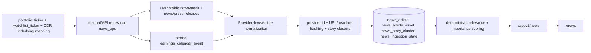

# Financial News Terminal

## Architecture

The news terminal uses a provider-neutral pipeline:

1. Provider adapters return `ProviderNewsArticle` records.
2. `normalize_provider_article` validates IDs, headlines, timestamps, URLs, language, sentiment, hashes, and raw payloads.
3. `NewsRepository` upserts normalized articles idempotently into DuckDB.
4. `EntityResolver` maps provider symbols and company aliases to internal assets with confidence and match method.
5. Deterministic classification assigns the controlled `news_category` taxonomy.
6. Story clustering groups same-event coverage by category, headline fingerprint, and resolved entities.
7. Ranking is computed in the service layer from importance, asset confidence, and portfolio exposure.
8. `NewsApiService` powers global, asset, portfolio, search, state, provider-health, and alert-rule APIs.
9. The React news terminal and asset/portfolio widgets render only normalized API responses.

Current production path:



`mock_news` remains a deterministic fixture provider for unit tests and explicit local fixture commands only. It is not used by `/news/refresh` or the normal browser execution path.

## Audit Summary

Root cause of stale/mock data: the provider-neutral news system existed, but only `mock_news` was registered operationally. The React page already called the backend, but there was no live provider adapter, no subscribed-symbol hydration path, no manual backend refresh endpoint, and earnings calendar rows were not projected into the news feed.

Reused infrastructure:

- `TickerUniverseRepository` resolves portfolio and watchlist symbols, including CDR underlying symbols.
- `NewsRepository`, `normalize_provider_article`, `EntityResolver`, deterministic classification, clustering, and ranking persist canonical records.
- `earnings_calendar_event` remains the earnings source of truth; the news layer creates normalized event cards from it instead of creating a second earnings table.

Known disconnected or limited paths:

- Social content is not integrated unless a compliant provider/widget is added. It must remain visually separate from verified reporting.
- SEC/SEDAR filings are not yet live-ingested in the news pipeline.
- FMP article metadata and summaries are stored; full article bodies are not stored.

## Schema

The `financial_news.sql` migration adds:

- `news_provider`
- `news_article` normalized extensions
- `asset_entity_alias`
- `news_article_asset`
- `news_article_entity`
- `news_category`
- `news_article_category`
- `news_story_cluster`
- `news_story_cluster_article`
- `news_ingestion_state`
- `news_user_article_state`
- `news_alert_rule`
- `news_alert_rule_asset`
- `news_alert_rule_portfolio`
- `news_alert_delivery`

Raw provider payloads are retained in `news_article.raw_payload_json` for debugging and reprocessing. UI and API reads must not query raw payloads directly.

## Entity Resolution

Resolution is intentionally conservative:

- Provider-supplied symbols are preferred.
- Exchange-qualified and direct asset-symbol matches receive high confidence.
- `asset_entity_alias` supports company names, CDR/ADR aliases, and cross-listing aliases.
- Ticker-only fallback is blocked for common collision symbols including `AI`, `A`, `C`, `F`, `IT`, `ON`, `NOW`, `ALL`, `CAT`, and `FOR` unless provider symbols or aliases corroborate the match.

Each match stores `relevance_score`, `confidence_score`, `match_method`, `mention_type`, `is_primary_entity`, and `provider_assigned`.

## Classification And Ranking

The taxonomy is deterministic and includes earnings, upcoming earnings, reported earnings, guidance, analyst actions, M&A, regulatory, regulatory filings, litigation, management changes, capital actions, macro, central bank, commodity, crypto, press releases, social posts, and general news.

Importance scoring combines provider importance, breaking status, category weight, sentiment severity, press-release penalty, correction/retraction penalty, and headline keywords. Portfolio ranking multiplies article importance by resolved-asset confidence and a bounded position-weight component so small holdings and repetitive press releases do not dominate the feed.

## API Endpoints

- `GET /api/v1/news`
- `GET /api/v1/news/latest`
- `GET /api/v1/news/breaking`
- `GET /api/v1/news/search`
- `GET /api/v1/news/articles/{article_id}`
- `POST /api/v1/news/articles/{article_id}/read`
- `POST /api/v1/news/articles/{article_id}/save`
- `DELETE /api/v1/news/articles/{article_id}/save`
- `POST /api/v1/news/refresh`
- `GET /api/v1/news/providers`
- `GET /api/v1/news/health`
- `GET /api/v1/news/categories`
- `GET /api/v1/news/alerts`
- `POST /api/v1/news/alerts`
- `PATCH /api/v1/news/alerts/{alert_rule_id}`
- `DELETE /api/v1/news/alerts/{alert_rule_id}`
- `GET /api/v1/assets/{asset_id}/news`
- `GET /api/v1/portfolios/{portfolio_id}/news`

Responses include provider attribution, UTC timestamps, category mappings, asset mappings, cluster metadata, ranking score, read/saved state, last successful sync time, cached-data status, and provider-health status.

`POST /api/v1/news/refresh` is throttled to avoid accidental request flooding. It refreshes FMP subscribed-symbol news when `FMP_API_KEY` is configured and always attempts to normalize currently stored subscribed earnings events.

## Provider Decision Matrix

| Provider | Data type | Coverage | Latency | Rate limits | Cost tier | Attribution | Storage restrictions | Current repository support | Decision |
| -------- | --------- | -------- | ------- | ----------- | --------- | ----------- | -------------------- | -------------------------- | -------- |
| Financial Modeling Prep stable API | Stock news, press releases, earnings calendar | Broad market news, symbol search, U.S.-focused press releases; repo already uses FMP earnings | Provider-dependent; suitable for periodic polling | Uses configured FMP rate limiter and plan limits | Depends on account plan | Display returned source/publisher and link to original URL | Store metadata, summaries, URLs, and auditable raw subset; do not store full article bodies unless licensed | Existing FMP key/config/rate limiter and earnings provider; new `FmpNewsProvider` | Primary company-news, press-release, and earnings source |
| Finnhub API | Company news, market news, optional newsroom/press releases | Company news endpoint covers North American companies; some endpoints premium | Good for company-news fallback where token/plan allows | 429 on exceeded limits plus plan limits | Free and paid plans | Display returned source and original URL | Store metadata/summaries only unless license permits more | Finnhub key exists for streaming prices, but no news adapter in repo | Documented fallback candidate, not enabled in code yet |
| SEC EDGAR | Regulatory filings | U.S. issuers only | Official source, filing-time dependent | Must respect SEC fair-access guidance | Free | SEC/company attribution | Filing metadata and links are safe; full filing text needs separate product decision | No current news adapter | Future authoritative filing path |
| Stocktwits/social providers | Social discussion | Provider/API dependent | Near real-time if authorized | Provider-specific | Depends on developer product | Must label as social/unverified | Do not scrape; store only permitted fields | Retail sentiment system exists for Reddit/X, but not Stocktwits | Deferred until authorized source is configured |

## Operations

Credential-free local fixture commands:

```powershell
.\.venv\Scripts\python.exe tools\news_ops.py refresh mock_news --limit 100
.\.venv\Scripts\python.exe tools\news_ops.py backfill-run mock_news --days 7 --limit 500
.\.venv\Scripts\python.exe tools\news_ops.py health
```

Live/subscribed hydration commands:

```powershell
.\.venv\Scripts\python.exe tools\news_ops.py refresh fmp_news --subscribed --limit 100
.\.venv\Scripts\python.exe tools\news_ops.py backfill-run fmp_news --subscribed --days 7 --limit 250
.\.venv\Scripts\python.exe tools\news_ops.py earnings-sync --lookback-days 14 --lookahead-days 60
```

The script defaults to `data/persistent_db.db`; pass `--db` to target another DuckDB file.

## Configuration

Configuration keys:

- `FMP_API_KEY`: server-side key for FMP news, press releases, and earnings provider calls.
- `FMP_RATE_LIMIT_PER_MINUTE`, `FMP_MIN_SECONDS_BETWEEN_CALLS`, `FMP_MAX_CALLS_PER_RUN`: shared FMP request bounds.
- `FINNHUB_API_KEY`: present for existing Finnhub integrations and future news fallback; not used by `/news/refresh` today.

No provider keys are required for explicit `mock_news` fixture commands.

## Failure Handling And Freshness

- Missing `FMP_API_KEY` records a failed `fmp_news/subscribed` sync state and the page shows provider degradation instead of mock fallback cards.
- The feed response includes `last_successful_sync_at`, `provider_status`, `provider_message`, and `is_cached`.
- Manual refresh is throttled for 15 minutes by default.
- Duplicate provider records are idempotent by provider article ID; syndicated or repeated stories are grouped into `news_story_cluster`.
- Provider symbols and internal asset identities are used for ticker relevance. Short ticker strings in article text are not enough for ambiguous symbols.

## Licensing

The platform stores article metadata, summaries, URLs, provider attribution, and a sanitized raw payload subset when provider terms allow it. Full article bodies must only be stored when the provider license explicitly permits storage and display. The frontend links to original sources instead of scraping or reproducing copyrighted article bodies. CNBC, Seeking Alpha, Reuters, MarketWatch, and similar publishers may appear only as the publisher/source returned by a licensed aggregation provider; the application must not imply direct publisher integration unless one is actually configured.

## Testing

Run the focused backend and frontend news tests:

```powershell
.\.venv\Scripts\python.exe -m pytest tests\news\test_news_foundation.py tests\api\test_news_api.py
cd web
npm.cmd test -- --run src/routes/newsRoute.test.tsx src/App.test.tsx src/routes/assetRoute.test.tsx src/routes/portfolioRoute.test.tsx
npm.cmd run build
```

## Remaining Limitations

- Feed freshness depends on the configured FMP plan, the number of subscribed tickers, and shared FMP rate limits.
- Canadian coverage depends on provider symbol support. CDRs are mapped to underlying symbols where the existing ticker universe can infer them.
- SEC/SEDAR filings and authorized social feeds remain future provider adapters.
- No LLM is required for ingestion, ranking, dedupe, or rendering; a future AI summary layer should operate only on already normalized records and should not become a critical-path dependency.
